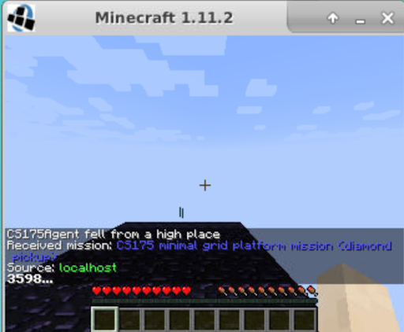

## Project Summary

Reinforcement learning is often evaluated purely on final performance. Did the agent win or not? This project takes a different approach. Rather than building the strongest possible agent, our goal is to understand how specific design choices shape the way an agent learns. We use Project Malmo, a platform developed by Microsoft Research that places AI agents inside the Minecraft game engine, as a controlled and repeatable testbed for studying these learning dynamics.

The task we designed is deliberately simple: a reinforcement learning agent is placed at one end of a narrow obsidian platform (5 blocks wide, 10 blocks long) elevated above a lava field, with a single diamond placed at the far end. The agent must navigate to the diamond without falling off the edge.

 
Every episode ends one of three ways. The agent picks up the diamond (success), falls off the platform into the lava (failure), or runs out of time (timeout). This setup may sound straightforward, but it is not trivial. The platform is narrow enough that random movement frequently leads to falling, and the agent receives no guidance about which direction to move. Without a learning algorithm, the agent has no way to distinguish a good move from a bad one. A purely random agent succeeds only about 33% of the time by chance, meaning there is real room for a learning agent to improve, but also real risk of failure if design choices are poorly made.

This is where the challenge lies. Decisions like how rewards are structured, what information the agent can observe, and which learning algorithm is used all fundamentally change what the agent experiences and how it updates its behavior.

A hand-coded solution might seem possible—just move forward until you reach the diamond. But the agent has no built-in knowledge of the environment's layout, where the edges are, or which direction leads to the goal. It receives only its current (x, z) coordinates at each step. Mapping these coordinates to optimal actions requires either human-engineered rules (which defeats the purpose of studying learning) or a learning algorithm that discovers the state-action relationship through experience. Reinforcement learning provides exactly this: a framework for learning optimal behavior through trial-and-error interaction with an unknown environment.

Our central question is not simply whether the agent can learn to succeed, but how different design choices shape that learning. We investigate how sparse rewards compare to shaped rewards with step penalties, how learning rate affects convergence speed and stability, and how much better a learning agent can perform relative to a random baseline. By isolating these variables and studying their effects, we gain insight into the mechanics of reinforcement learning itself—insight that generalizes beyond this specific task to inform how practitioners should approach RL design decisions in other domains.

## Approach

### Environment Setup

The environment is implemented as a custom wrapper around the Project Malmo SDK, exposing a simple `reset()` and `step()` interface consistent with the OpenAI Gym convention. On each call to `reset()`, a new Malmo mission is launched and the agent is placed at position (x=0.5, z=0.5, y=51) at the start of the platform. The diamond is placed at (x=0, z=9, y=51) at the far end. The platform itself is a 5×10 grid of obsidian blocks at y=50, surrounded by lava at y=5.

### State / Observation Space

At each step, the agent receives an observation dictionary containing its current grid position: {x, z, y}, where x and z are rounded to the nearest integer and y is a continuous float used for fall detection. The observation is read from Malmo's ObservationFromFullStats handler, which exposes the agent's position and inventory. No visual input (pixels) is used.

### Action Space

The agent has four discrete actions:

| ID | Action | Malmo Command |
|----|--------|---------------|
| 0 | Move North | move 1 |
| 1 | Move South | move -1 |
| 2 | Move West | strafe -1 |
| 3 | Move East | strafe 1 |

Each action is held for 4 ticks (~0.4 seconds) before motion is stopped, giving the agent time to physically move one block in the chosen direction.

### Reward Structure

The reward function is sparse and terminal — rewards are only given when an episode ends:

- **+1.0** — agent picks up the diamond (success_diamond_picked_up)
- **−1.0** — agent falls off the platform (failure_fell_off_platform)
- **0.0** — episode times out (timeout_max_steps_reached)

No intermediate rewards are given for steps taken. This is intentional for the baseline experiments, as it gives us a clean signal to compare against shaped reward variants in future experiments.

### Random Baseline Agent

The first agent we evaluate is a random policy. At every step it selects one of the four actions uniformly at random, with no use of observations, memory, or learning:

```python
action = randint(0, 3)
```

This agent implements only `select_action(obs, info)` and has no `observe()` method, meaning the training harness never calls any update step. It is the canonical no-learning baseline, where any learning algorithm should eventually surpass it.

### Training Harness

All agents are run through a shared episode loop in `harness/loop.py`. The loop calls `env.reset()` at the start of each episode, then repeatedly calls `agent.select_action()` and `env.step()` until `done=True`. If the agent implements an `observe(obs, action, reward, next_obs, done, info)` method, the harness calls it after each step to allow learning agents to update. Per-episode statistics, total reward, steps, success, termination reason, and seed, are recorded for every episode.

### Hyperparameters

| Parameter | Value | Notes |
|-----------|-------|-------|
| num_episodes | 50–200 | Configurable via JSON config |
| max_steps | 200 | Maximum steps per episode before timeout |
| move_ticks | 4 | Ticks per action (~0.4s of movement) |
| platform_y | 51 | Y-level used for fall detection |
| seed | 42 | Fixed for reproducibility |

Configurations are defined in JSON files under `configs/` (e.g. `configs/random_baseline.json`) and passed to the run script, making all experiments fully reproducible.

### Tabular Q-Learning Algorithm

We implemented standard tabular Q-learning, a model-free reinforcement learning algorithm that learns an action-value function Q(s,a) representing the expected cumulative reward from taking action a in state s and following the optimal policy thereafter (Sutton & Barto, 2018). The Q-table is updated after each transition using the Bellman equation:

**Q(s,a) ← Q(s,a) + α [ r + γ max_a′ Q(s′,a′) − Q(s,a) ]**

where:
- **α (learning rate)**: Controls how much new information overwrites the existing Q-value estimate
- **γ (discount factor)**: Set to 0.99, determines the importance of future rewards relative to immediate rewards
- **r**: The immediate reward received after taking action a in state s
- **max_a′ Q(s′,a′)**: The maximum Q-value achievable from the next state s′

The Q-table is initialized to zeros for all state-action pairs. States are discretized as (x, z) grid positions, yielding a manageable state space of approximately 50 unique states (5 × 10 platform).

### Exploration Strategy

Balancing exploration and exploitation is critical in reinforcement learning. We use an **epsilon-greedy policy** with linear decay:

- **Initial ε = 0.5**: The agent explores randomly 50% of the time at the start of training
- **Final ε = 0.05**: Exploration decreases to 5% by the end of training
- **Decay schedule**: Linear decay over 150 episodes

At each step, the agent selects a random action with probability ε, or the action with the highest Q-value with probability (1 − ε). This strategy ensures sufficient exploration early in training while shifting toward exploitation as the Q-values converge.

### Hyperparameter Experiments

To study how design choices affect learning, we systematically varied two key factors:

**Learning Rate Comparison (α)**

Smith (2017) establishes α = 0.1 as a standard baseline for iterative optimization, noting that learning rate is a highly sensitive hyperparameter. We compare:

| Learning Rate | Update Magnitude | Expected Behavior |
|--------------|------------------|-------------------|
| α = 0.1 | 10% new, 90% retained | Slower, more stable convergence |
| α = 0.5 | 50% new, 50% retained | Faster adaptation, higher variance |

**Reward Shaping Comparison**

| Reward Scheme | Diamond | Fall | Step | Design Intent |
|---------------|---------|------|------|---------------|
| Sparse | +1.0 | −1.0 | 0.0 | Clean signal, delayed feedback |
| Step Penalty | +1.0 | −1.0 | −0.01 | Encourage efficiency |

The step penalty was intended to discourage slow, meandering behavior. However, as documented in the Evaluation section, this shaping inadvertently incentivized risky, short-duration episodes.


## Evaluation 


## Resources Used

This project relies on a small set of tools and references to implement and evaluate reinforcement-learning behavior in a Minecraft-based environment.

### Libraries and Frameworks

- **Project Malmo (`MalmoPython`, Microsoft Research)**: The primary RL environment and API used to run missions in Minecraft and obtain observations and rewards. It enabled us to study agent behavior in a controlled task setting.
- **matplotlib (optional)**: Used to produce simple visual summaries of results (e.g., reward trends across episodes) for reporting.

### Platforms and Environment

- **Docker + `andkram/malmo` image**: Provided a consistent runtime with Minecraft, Malmo, and Python preconfigured. This reduced setup overhead and improved reproducibility across machines.
- **Minecraft (Malmo mod)**: Served as the simulator where the agent navigates a platform to reach the goal (diamond pickup). It provided the interactive dynamics required for the task.
- **noVNC / Jupyter Notebook**: Used for visualization and interactive testing (monitoring Minecraft, running small exploratory checks) during development.

### Algorithms and Conceptual Resources

- **Tabular Q-learning**: Implemented using the standard Bellman update with epsilon-greedy exploration to learn an action-value table over discrete states.
- **Baseline policies (random and fixed-direction)**: Used as non-learning reference policies to contextualize learning performance.
- **Gym-style environment design (conceptual)**: Used as an organizing interface (`reset`/`step`) for consistent experiments; the project does not depend on the `gym` package.

### Key Python Utilities

- **`json`**: Used for reading experiment configs and handling structured inputs/outputs.
- **`random`**: Used for baseline action selection and exploration in Q-learning.
- **`argparse`**: Used to provide clear command-line interfaces for running experiments.

### AI Tools

- **ChatGPT and Cursor (AI assistants)**: Used to clarify RL/Malmo concepts, refine report-style wording, and suggest boilerplate patterns (e.g., CLI/logging structure). Their influence appears primarily in documentation phrasing, script structure, and minor helper code; the final algorithms, environment setup, and results were implemented and verified by the project team.

### Copied/Adapted Code

- **External code reuse**: No external code was directly copied; implementations follow standard reinforcement-learning and Project Malmo usage patterns.
