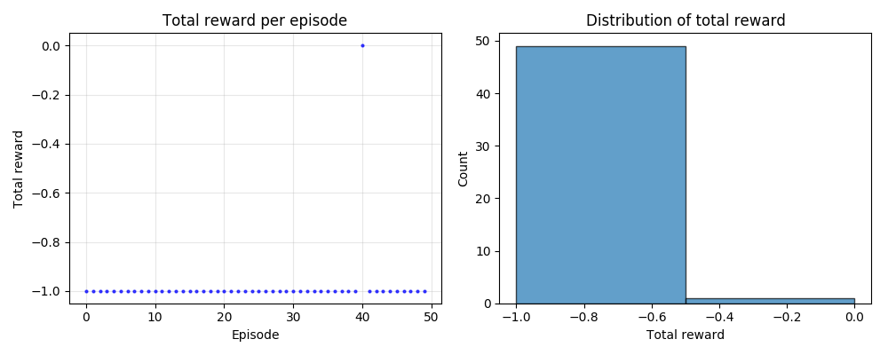

## About Project Malmo

This project investigates reinforcement learning by training an agent (Steve) to navigate a simplified Minecraft environment. The agent must reach a diamond on an elevated platform while avoiding falling into lava. We study how different design choices, such as reward structures, state representations, and learning algorithms, affect learning behavior.

## Source Code

[GitHub Repository](https://github.com/TaylorTraan/projectmalmo)

## Reports

- [Proposal](proposal.html)
- [Status](status.html)
- [Final](final.html)

## Resources

- [Project Malmo](https://github.com/microsoft/malmo) - Minecraft AI research platform
- [MineRL](https://minerl.io/) - Minecraft reinforcement learning competition
- [OpenAI Gym](https://gymnasium.farama.org/) - RL environment toolkit

## Baseline Results

*Random policy baseline: ~2% success rate, demonstrating that the task requires learning to solve reliably.*
