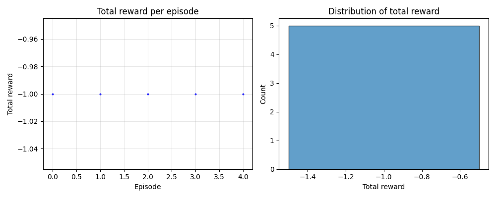

## About Project Malmo

This project investigates reinforcement learning by training an agent (Steve) to navigate a simplified Minecraft environment. The agent must reach a diamond on an elevated platform while avoiding falling into lava. We study how different design choices, such as reward structures, state representations, and learning algorithms, affect learning behavior.

## Source Code

[GitHub Repository](https://github.com/TaylorTraan/projectmalmo)

## Reports

- [Proposal](proposal.html)
- [Status](status.html)
- [Final](final.html)

## Resources

- [Project Malmo](https://github.com/microsoft/malmo) - Minecraft AI research platform
- [MineRL](https://minerl.io/) - Minecraft reinforcement learning competition
- [OpenAI Gym](https://gymnasium.farama.org/) - RL environment toolkit

## Baseline Results

Over 50 episodes, the random policy agent received a total reward of -1.0 in nearly every episode, indicating the agent fell off the platform almost every time. One episode resulted in a reward of 0.0, suggesting the agent survived until the step limit without dying or collecting the diamond. With no learning mechanism, the agent shows no improvement over time, confirming this as a true baseline for comparison.

## Tabular Q-Learning Results

After 5 episodes of tabular Q-learning, all episodes terminated with a reward of -1.0, meaning the agent fell off the platform every time. This is expected behavior at such an early stage of training, as the Q-table has had minimal state visitation and the agent's behavior is effectively random. These results establish a starting point; meaningful learning is only expected to emerge after significantly more episodes.
