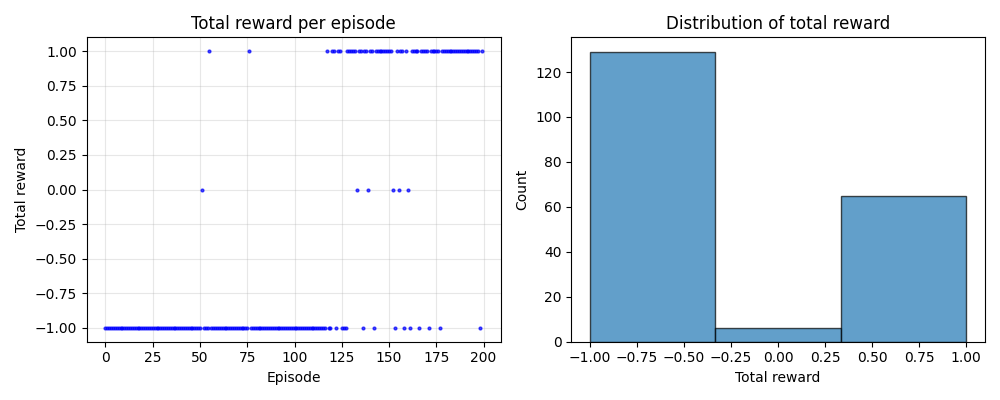
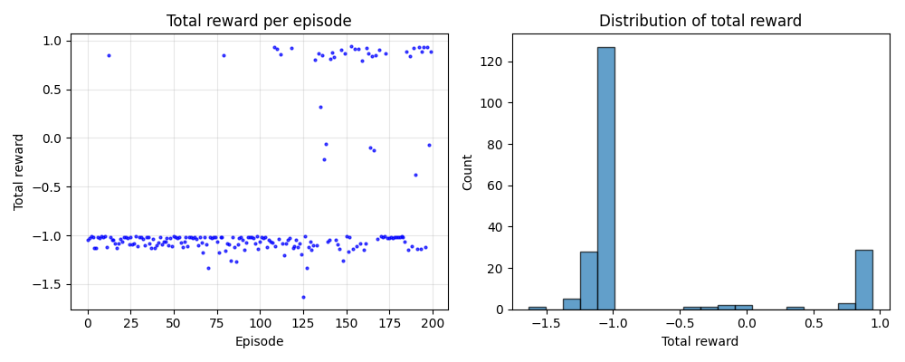

## LINK TO PROJECT VIDEO

https://www.youtube.com/watch?v=SsZ2_gHq7lU

## Project Summary

Our project studies how reinforcement learning design decisions affect behavior in a simplified Minecraft navigation task using Project Malmo. The objective is for an agent (Steve) to retrieve a diamond while avoiding falling off a platform. We implement tabular Q-learning within a custom Malmo environment wrapper and systematically analyze how learning rate and reward design influence convergence speed, stability, and overall success rate. Rather than simply demonstrating that an agent can succeed, our goal is to evaluate how hyperparameter choices and reward shaping alter learning dynamics and policy behavior.

---

## Approach

We structured the environment using a standardized interface with `reset()` and `step(action)` functions, isolating all Minecraft-specific logic inside `env/malmo_env.py`. This wrapper abstracts mission initialization, observation parsing, reward handling, and termination conditions, allowing the Q-learning agent to interact with the environment in a clean and reproducible way. Each episode begins with `reset()`, proceeds through repeated calls to `step(action)`, and terminates when the agent either retrieves the diamond, falls off the platform, or reaches the maximum step limit.

We implemented standard tabular Q-learning using the update rule:

Q(s,a) ← Q(s,a) + α [ r + γ maxₐ′ Q(s′,a′) − Q(s,a) ]

where α is the learning rate, γ = 0.99 is the discount factor, and r is the immediate reward. Exploration is handled via an epsilon-greedy policy with linear decay from 0.5 to 0.05 over 150 episodes. Each experiment was run for 200 episodes using a single random seed.

To study hyperparameter sensitivity, we compared two learning rates: α = 0.1 (baseline) and α = 0.5 (aggressive). The learning rate controls how much new experiences overwrite existing Q-value estimates. With α = 0.1, each update incorporates 10% new information and retains 90% of the prior estimate, producing slower but more stable learning. With α = 0.5, updates are much larger, enabling faster adaptation but increasing sensitivity to stochastic transitions and reward noise.

We also compared two reward schemes. The first used sparse rewards: +1 for retrieving the diamond, −1 for falling, and 0 otherwise. The second introduced reward shaping via a small per-step penalty (−0.01 per time step). This modification was intended to encourage efficiency but significantly altered policy incentives.

---

## Evaluation

We evaluated performance using total reward per episode, success rate (diamond retrieval), episode length, and termination statistics. Each configuration was trained for 200 episodes.

### Learning Rate Comparison

Smith (2017) uses an initial learning rate of 0.1 as a baseline in evaluating training performance across multiple architectures, treating it as a standard reference point for comparison against alternative learning rate strategies. The study demonstrates that learning rate is a highly sensitive hyperparameter and that performance can vary significantly as it changes. Because 0.1 is used in the literature as a conventional baseline value for iterative optimization, we adopt α = 0.1 as a stable and principled reference point in our experiments before evaluating more aggressive alternatives such as α = 0.5. 

Source: Smith, Leslie N. "Cyclical learning rates for training neural networks." 2017 IEEE winter conference on applications of computer vision (WACV). IEEE, 2017.

Under sparse rewards, the configuration with α = 0.5 achieved a higher success rate (32.5%) than α = 0.1 under the shaped reward configuration, with correspondingly higher mean reward. Although α = 0.5 is theoretically more prone to instability due to larger update magnitudes, we did not observe major divergence within 200 episodes. The relatively modest difference between learning rates alone suggests that 200 episodes with a single seed may not be sufficient to expose long-term convergence differences. The results remain noisy and influenced by stochastic exploration.

 

The reward curve shows increasing occurrences of successful (+1) episodes in later training, indicating that the agent is learning a policy that occasionally retrieves the diamond. The distribution histogram reflects a mixture of failures and successes, consistent with partial convergence.

---

### Reward Shaping Analysis

When introducing the step-penalty reward scheme (−0.01 per time step), performance decreased substantially. The success rate dropped to 16.5%, mean episode length decreased to approximately 9.7 steps, and the number of falls increased significantly compared to the sparse reward configuration.

The reward distribution is heavily concentrated around negative values, indicating frequent early termination. Because each additional time step incurred a small negative reward, the agent was implicitly incentivized to end episodes quickly. This unintentionally made short, risky behavior (rushing and falling) relatively less costly than longer, cautious trajectories aimed at reaching the diamond.

This experiment demonstrates an important reinforcement learning principle: reward shaping can significantly alter learned behavior even when the underlying algorithm remains unchanged. In our case, the shaping unintentionally biased the agent toward premature episode termination rather than safe navigation.

---

### Quantitative Comparison

**[Insert Table 1 here: Performance Comparison Table]**

| Configuration | Success Rate | Mean Reward | Mean Steps | Failures |
|---------------|-------------|-------------|------------|----------|
| α = 0.5 (Sparse) | 32.5% | -0.33 | 16.4 | 129 |
| α = 0.1 (Step Penalty) | 16.5% | -0.73 | 9.7 | 161 |

The table highlights that the most significant behavioral change resulted from modifying the reward function rather than adjusting the learning rate alone.

---

## Remaining Goals and Challenges

Although the learning pipeline is fully functional, the experimental analysis remains incomplete. All current results were generated using only 200 episodes and a single random seed, which makes outcomes highly sensitive to randomness. To produce more reliable conclusions, we plan to run multiple seeds, extend training duration, and conduct systematic hyperparameter sweeps across learning rate values (e.g., 0.05, 0.1, 0.3, 0.5). We also intend to vary the magnitude of the step penalty to determine whether milder shaping improves efficiency without encouraging premature termination.

A key anticipated challenge is variance in sparse-reward environments, which slows value propagation and makes convergence noisy. Additionally, poorly calibrated reward shaping may distort optimal behavior. At this stage, the primary challenge is not implementation but obtaining sufficiently robust experimental evidence to support stronger empirical conclusions.

---

## Resources Used

We relied on the Project Malmo documentation for environment configuration and mission setup, particularly for understanding agent communication, reward signaling, and mission lifecycle management. For reinforcement learning implementation details, we referenced Sutton & Barto’s *Reinforcement Learning: An Introduction*, especially the tabular Q-learning update rule and epsilon-greedy exploration strategy. Course lecture materials informed our hyperparameter choices and experimental design.

We also used Docker to ensure reproducibility of experiments across machines, allowing consistent Python versions and Malmo bindings. Debugging resources such as official documentation and community forums were used when resolving container and mission initialization issues.

